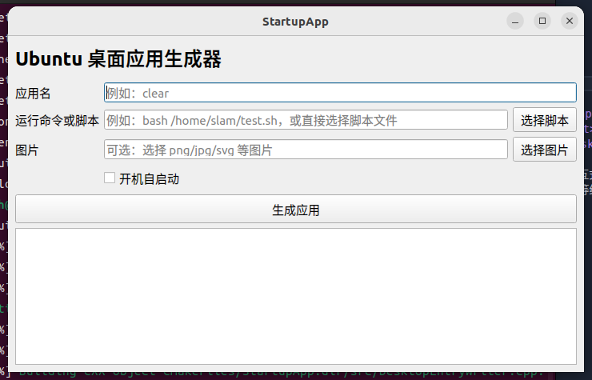

# StartupApp

Ubuntu22.04/20.04 桌面应用生成器。
可设置应用自启动等功能

## 功能

- 设置应用名
- 设置一个可以在终端中运行的命令或脚本
- 可选选择应用图片
- 可选生成开机自启动入口
- 可从界面删除已生成的自定义应用、自启动入口和复制的图标
- 每个自定义应用单实例运行，避免侧边栏“新增窗口”或重复点击导致重复启动

生成位置：

- 应用入口：`~/.local/share/applications/<app-id>.desktop`
- 启动脚本：`~/.local/bin/startupapp/<app-id>.sh`
- 图标：`~/.local/share/icons/<app-id>.<ext>`
- 自启动：`~/.config/autostart/<app-id>.desktop`

生成的应用会把用户填写的命令写入启动脚本，再打开 `gnome-terminal`，用交互式 `bash` 运行该脚本。应用会读取你的终端环境，终端里能运行的命令在自定义应用里也应保持同样行为。启动脚本会使用运行时锁防止同一个应用重复运行；生成器也会为每个应用设置独立窗口类，便于 Ubuntu 侧边栏收藏后正确识别对应窗口。

如果要创建“关闭所有 GNOME 终端”的应用，建议填写：

```bash
pkill -f gnome-terminal-server
```

不要填写 `bash 'killall bash'`；这种写法会让 `bash` 去寻找名为 `killall bash` 的脚本文件，而不是执行 `killall bash` 命令。

如果正在用 `ros2 bag record` 录包，不要直接关闭终端，否则 bag 可能来不及写入 metadata，导致无法 `play`。建议 clear 应用改成先给录包进程发送 SIGINT，再等待几秒关闭终端：

```bash
pkill -INT -f "ros2 bag record"; sleep 5; pkill -f gnome-terminal-server
```

## 编译

```bash
cmake -S . -B build
cmake --build build
```

## 运行

```bash
./build/StartupApp
```
